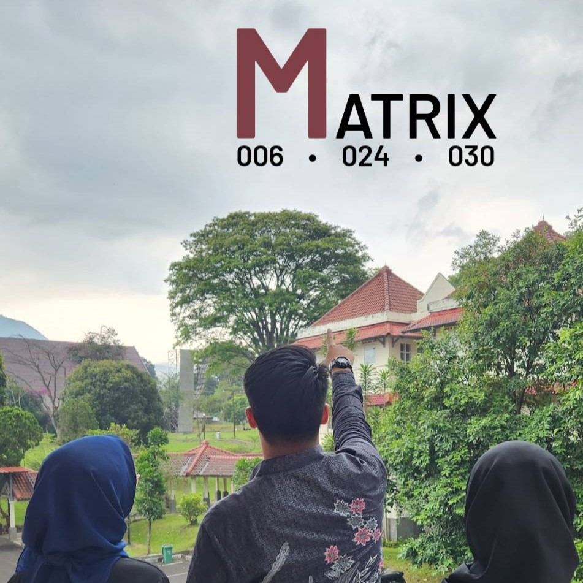

# Tugas Besar 1 IF2123 - Aljabar Linear dan Geometri
## Kelompok 16 - A16EO

| NIM | Nama |
| :---: | :---: |
| 13521006 | Azmi Hasna Zahrani |
| 13521024 | Ahmad Nadil |
| 13521030 | Jauza Lathifah Annassalafi |

## Tentang Program Ini
- Menyelesaikan Sistem Persamaan Linear (SPL) dengan metode Gauss, Gauss-Jordan, Inverse (Balikan), dan Cramer
- Menghitung determinan sebuah matriks dengan metode ekspansi kofaktor dan inverse matriks
- Menyelesaikan interpolasi polinom
- Menyelesaikan interpolasi bicubic
- Menyelesaikan permesalahan regresi linear berganda

## Struktur Program
```bash
.
│   README.md
│
├───bin                                     # Bytecode
│   ├───Functions
│   │       Bicubic.class
│   │       Interpolate.class
│   │       Inverse.class
│   │       linearRegression.class
│   │       Operations.class
│   │       SPL.class
│   │
│   ├───Main
│   │       Main.class
│   │
│   ├───Matrix
│           Input_Matrix.class
│           Matrix.class
│           Output_Matrix.class
│
├───doc                             # Documentation
├───src                             # Source code
│   ├───Functions                   # Function package
│   │       Bicubic.java
│   │       Interpolate.java
│   │       Inverse.java
│   │       linearRegression.java
│   │       Operations.java
│   │       SPL.java
│   │
│   ├───Main                        # Main package   
│   │       Main.java
│   │
│   ├───Matrix                      # Matrix package
│           Input_Matrix.java
│           Matrix.java
│           Output_Matrix.java
│
└───test                            # Testing cases
    │   studikasus1a.txt
    │   studikasus1b.txt
    │   studikasus1c.txt
    │   studikasus2a.txt
    │   studikasus2b.txt
    │   studikasus3a.txt
    │   studikasus3b.txt
    │   studikasus4.txt
    │   studikasus4a.txt
    │   studikasus4b.txt
    │   studikasus4c.txt
    │   studikasus5.txt
    │
    └───result                      # Result file directory
```

## Cara Run Program
1. Di folder src : 

Untuk pindah ke folder src : `cd src`

`javac -d ..\bin Matrix/*.java Functions/*.java Main/*.java`

2. Di folder bin : 

Untuk pindah ke folder bin : `cd bin`

`java Main.Main`

## Dokum
